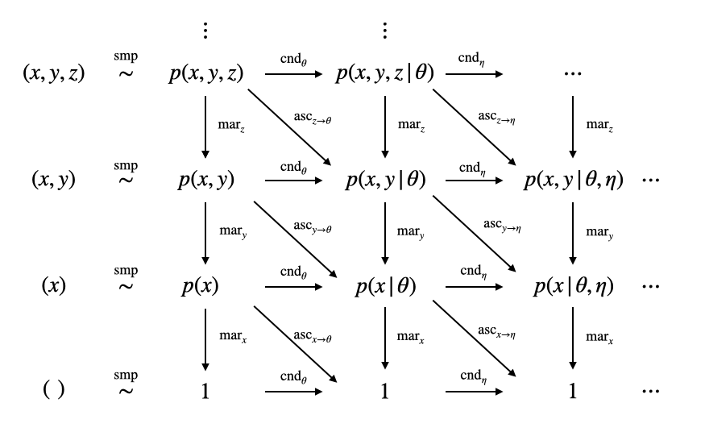

# 2.1.2. 確率論

## 確率論

機械学習で確率モデルを扱うときは、確率分布に対する変形操作が頻繁に発生するので、よく使われる操作についてここで整理しておこう。

また、機械学習で使われる確率論の言葉遣いや表記については慣習的に一部わかりにくいものが横行しているので、一応私が整理したものをここに書いておく。最終的には、確率分布に対して定義される5種類の操作のうち4種類はひとつの表にまとめることができ、以下の整理表が作れる。復習のための早見表と思って勉強に役立ててもらえたら幸いである。

本書では適宜ここに書いたものを用いて説明するが、あくまで私が個人的に整理したものなので他所ではなるべく使わないように。

## 確率分布

確率分布という言葉を用いると難しく聞こえるが、確率分布とは要はサイコロの概念の一般化である。

たとえば六面サイコロは$$1$$〜$$6$$の整数しか表現できないので、$$1$$〜$$20$$のランダムな整数が欲しければ二十面サイコロを用いるだろう。また、イカサマで$$1$$がたくさん出てほしいならば$$6$$の面に重心が偏ったサイコロを使うだろう。この欲しい値の範囲に応じてサイコロを取り替える操作が「確率分布を選ぶ」ことに相当する。では基本的な部分を見ていこう。

確率変数$$x$$についての関数$$p(x)$$があり、$$x$$の定義域$$\Omega$$におけるルベーグ積分が

$$
\int _ {\Omega} p(x) d\mu(x) = 1
$$

を満たすとき、$$p(x)$$を**確率分布**（probability distribution）または**確率分布関数**（probability distribution function）という。**確率変数**（random variable）が厳密になんであるかはルベーグ積分の教科書を参照してほしいが、直感的には振る前のサイコロ、定まる前のランダムな値のことである。

ルベーグ積分というといきなり難解に思えるが、通常よく扱う確率分布に関しては$$\Omega$$が有限集合なら総和$$\Sigma$$、無限集合（連続体濃度）ならば高校で習う普通の積分（リーマン積分）に一致すると思ってよい。ルベーグ積分はそれらの概念の一般化であり、よっぽど難しいことをしない限り意識することはない。たとえばどの目が出る確率も同様に確からしい六面サイコロの確率分布は

$$
p(x) = \frac{1}{6}
$$

であり、その全体集合$$\Omega$$におけるルベーグ積分は

$$
\begin{aligned}
\int _ {\Omega} p(x)d\mu(x) &= \sum _ {x = 1} ^ 6 p(x) \mu(\{ x\} ) \\
&= \frac{1}{6} \cdot \mu(\{1\}) + \frac{1}{6} \cdot \mu(\{2\}) +  \frac{1}{6} \cdot \mu(\{3\}) \\
& \quad + \frac{1}{6} \cdot \mu(\{4\}) + \frac{1}{6} \cdot \mu(\{5\}) + \frac{1}{6} \cdot \mu(\{6\}) \\
&= \frac{1}{6} + \frac{1}{6} + \frac{1}{6} + \frac{1}{6} + \frac{1}{6} + \frac{1}{6} \\
&= 1
\end{aligned}
$$

である。$$\mu(\cdot)$$は**測度**（measure）と呼ばれる関数で、イメージとしては集合の大きさを表す指標である。サイコロを扱う場合ではどの目が出る事象も大きさは等しく$$1$$である。これがたとえば「$$1$$または$$2$$の目が出る事象を表す集合」の測度になれば

$$
\mu(\{ 1, 2\}) = \mu(\{1\})  + \mu (\{ 2\}) = 2
$$

となる性質があり、集合の大きさが$$2$$になったことは直感にも一致する。全体集合$$\Omega$$の部分集合について確率分布をルベーグ積分した値を**確率**（probability）といい、「$$1$$または$$2$$の目が出る確率」は

$$
\begin{aligned}
\int _ {\{ 1, 2\}} p(x) d \mu(x) &= \frac{1}{6} \cdot  \mu(\{1, 2 \}) \\
&= \frac{1}{6} \cdot \mu(\{1\}) + \frac{1}{6} \cdot \mu(\{2\}) \\
&= \frac{1}{6} + \frac{1}{6} \\
&= \frac{1}{3}
\end{aligned}
$$

と計算できる。イメージ的には、ルベーグ積分は確率という概念を「事象の起こりやすさ（確率分布）」と「事象の大きさ（測度）」の積の総和で表現しているとも考えられる。

いまのように$$\Omega$$が有限集合のときの確率分布を**離散型確率分布**（discrete probability distribution）と呼び、このときの$$p(x)$$を**確率質量関数**（probability mass function）とも呼ぶ。

一方で$$\Omega$$が無限集合（連続体濃度）のときの確率分布を**連続型確率分布**（continuous probability distribution）といい、このときの$$p(x)$$は**確率密度関数**（probability density function）とも呼ばれる。たとえば実数全体で定義されているガウス分布は

$$
p(x) = \frac{1}{\sqrt{2 \pi \sigma ^ 2}} \exp \left( - \frac{(x - \mu) ^ 2}{2 \sigma ^ 2} \right)
$$

であり、その全体集合$$\Omega = \mathbb{R}$$におけるルベーグ積分の結果はリーマン積分の結果と一致して

$$
\begin{aligned}
\int _ \Omega p(x) d \mu (x) = \int _ {- \infty} ^ {+ \infty} p(x) dx = 1
\end{aligned}
$$

である。上式第二辺はリーマン積分である。連続関数の測度はここでは詳しく解説しないが、イメージとしては定義域の区間$$[a,b)$$の測度を

$$
\mu([a,b)) = b - a
$$

と定義する。この区間を等間隔に非常に細かく区切るとリーマン積分になると思えばよい。気になる場合は各自ルベーグ積分の書籍を参照のこと。

ともかく、ルベーグ積分を使っておけば総和とリーマン積分をどちらも

$$
\int _ {\Omega} p(x) d\mu(x)
$$

と書けるので便利なのだ。ここまでの説明ではリーマン積分との混同を避けるため丁寧に書いていたが、大抵はさらに略記して

$$
\int _ {\Omega} p(x) dx
$$

と書き、これ以降は本書でもこの表記を用いる。

## 多変量確率分布

**多変量確率分布**（multivariate probability distribution）は複数の確率変数を扱うよう定義された確率分布で、サイコロをいくつか同時に振ろうとすることの一般化である。たとえば2個のサイコロ$$x _ 1, x _ 2$$を同時に振るときの確率分布は

$$
p(x _ 1, x _ 2)
$$

と表記する。これを確率変数$$x _ 1$$と$$x _ 2$$の**同時確率分布**（joint probability distribution）という。$$n$$個のサイコロを同時に振るときは

$$
p(x _ 1, x _ 2, \ldots, x _ n)
$$

と書くことになるが、面倒臭いので単に

$$
p(x) = p(x _ 1, x _ 2, \ldots, x _ n)
$$

として単に$$p(x)$$で表記されることが多い。また、$$m$$個のサイコロを1群、$$n$$個のサイコロを2群とまとめ直して

$$
p(x, y) = p(x_ 1, x_ 2, \ldots, x _ m, y _ 1, y _ 2, \ldots, y _ n)
$$

のように表記していることもあるので、$$p(x,y)$$と書かれていても確率変数が2個とは限らない。

つまり今後$$p(x)$$や$$p(x, y)$$という表記を見たときは、それぞれの文字がいくつの確率変数に対応しているのか文脈から判断してほしい。回帰問題の章まで進めばわかるが、いちいちすべての確率変数を書き下していると式が煩雑でページに収まりきらなくなるので、本書に限らず大抵の場合は読みやすさを優先した記法が採用されることになる。

## 条件付き確率分布

ここまでの言葉遣いをいま一度サイコロのイメージと対応づけておくと、確率変数とは振る前のサイコロのことであり、確率分布はサイコロの目の出やすさを表したものである。またここまで登場しなかったが、サイコロを振る操作のことは**試行**（trial）または**抽出**（sampling）と呼ばれ、試行によって得られた値（サイコロを振って出た目）のことを**実現値**（realized value）という。

ある確率変数$$x$$の確率分布が他の確率変数$$\theta$$の実現値によって決まるとき、$$xの$$確率分布を

$$
p(x \mid \theta)
$$

と表記する。これを$$x$$の$$\theta$$による**条件付き確率分布**（conditional probability distribution）という。条件付き確率分布において$$\theta$$の側にある確率変数のことをパラメータ（parameter）と呼ぶこともあるが、本書では条件変数（conditional variable）

たとえばガウス分布は

$$
p(x) = \frac{1}{\sqrt{2 \pi \sigma ^ 2}} \exp \left( - \frac{(x - \mu) ^ 2}{2 \sigma ^ 2} \right)
$$

と定義されていたが、これは$$x$$の他に平均$$\mu$$と分散$$\sigma ^ 2$$の値が定まらなければ$$x$$の確率分布は実際のところどんなものかわからないということでもある。平均$$\mu$$や分散$$\sigma ^ 2$$は人間が勝手に決めたりデータから定まったりする値だが、偶然その値が定まった、つまり$$\mu$$や$$\sigma ^2 $$も確率変数なのだと考えれば、確率変数$$x$$の確率分布は他の確率変数$$\mu, \sigma ^ 2$$の実現値によって定まったのだとみなせる。したがってこれは条件付き確率分布

$$
p(x | \mu ,\sigma ^2) = \frac{1}{\sqrt{2 \pi \sigma ^ 2}} \exp \left( - \frac{(x - \mu) ^ 2}{2 \sigma ^ 2} \right)
$$

とみなせる。

条件付き確率分布$$p(x | \theta)$$からサンプリングできる実現値は$$x$$のみであり、条件付き確率分布は \| の右側の確率変数が定まってからでないとサンプリングできないから、サンプリングという操作を行う段階では$$\theta$$の側は定数である。

## 確率密度

今後の説明の見通しをよくするために、**確率密度**（probability density）について話しておこう。確率密度は確率密度関数の確率変数に固定値を代入して得られる値である。後の最尤推定で登場する尤度関数や、MAP推定で登場する事後確率と呼ばれるものは、確率密度であると解釈すると「確率密度に関する最適化問題」と一括りに扱えるので都合がよい（一般的な解釈ではないので他所では使わないこと。私も本書でのみ用いることにする）。

確率密度とは確率密度関数$$p(x)$$の確率変数$$x$$に、具体的な値$$X$$を代入した

$$
p(x = X)
$$

のことである。確率変数に具体的な値を代入する操作を本書では**観測**（observation）と呼ぶことにする。観測するときに代入する値は人間が勝手に決めてよい（任意の値を代入してその値に対応する確率密度を確かめることができる）ことから、観測は試行とは異なる操作である。

### 同時確率分布の確率密度

観測は確率変数の一部または全部に対して行うことができる。たとえば確率密度関数$$p(x,y)$$の$$y$$についてのみ観測を行った

$$
p(x, y = Y)
$$

もやはり確率密度である。これはたとえばサイコロを2つ同時に投げ、そのうちの片方だけを覗き見たら$$Y$$の目が出ていた、という状況に相当する。

同時確率分布の確率密度は一般に確率密度関数の定義を満たさない。これは証明しておこう。たとえば確率変数$$x,y$$が独立なとき、独立試行の確率の性質から

$$
p(x,y)=p(x)p(y)
$$

が成り立つが、$$y$$について観測したあとでは$$p(y = Y)$$は定数でありその定数も$$1$$とは限らないから、一般には

$$
p(y=Y) = c \neq1
$$

であり、

$$
p(x, y=Y) = c \cdot p(x)
$$

となる。ところが

$$
\int _ \Omega c \cdot p(x) dx = c \int _ \Omega p(x) dx = c \neq 1
$$

であるから、確率密度$$p(x, y=Y)$$は確率密度関数の定義を満たさない。証明終。

### 条件付き確率分布の確率密度

条件付き確率分布については、\| の右側について観測を行う分には確率密度は以前として確率密度関数の定義を満たす。つまり

$$
p(x | \theta = \Theta)
$$

は確率密度関数である。たとえばガウス分布では平均$$\mu = \mu _ 0$$、分散$$\sigma ^ 2 = \sigma _ 0 ^2$$としたとき

$$
p(x | \mu = \mu _ 0, \sigma ^ 2 = \sigma _ 0 ^ 2) =\frac{1}{\sqrt{2 \pi \sigma _ 0 ^ 2}} \exp \left( - \frac{(x - \mu _ 0) ^ 2}{2 \sigma _ 0 ^ 2} \right)
$$

である。一方で \| の左側について観測を行ったときの確率密度は一般には確率密度関数の定義を満たさない。つまり

$$
p(x = X | \theta)
$$

は確率密度関数ではない。その証明として、たとえばガウス分布で$$x=X, \mu = X$$として、$$\lambda=\sigma ^ 2$$と変数変換すると、

$$
\begin{aligned}
\int _ 0 ^ {+ \infty } p(x = X | \mu = X, \lambda ) d \lambda  &= \int _ 0 ^ {+ \infty }  \frac{1}{\sqrt{2 \pi \lambda}} \exp \left( - \frac{(X - X) ^ 2}{2 \lambda} \right) d \lambda \\
&=\int _ 0 ^ {+ \infty }  \frac{1}{\sqrt{2 \pi \lambda}} \exp \left( 0 \right) d \lambda \\
&= \frac{1}{\sqrt{2 \pi}} \int _ 0 ^ {+ \infty }  \frac{1}{\sqrt{\lambda}} d \lambda \\
&= \frac{1}{\sqrt{2 \pi}}  \left[ \lambda ^ {1/2}\right] _ 0 ^ {+\infty} \\
&\to ＋\infty
\end{aligned}
$$

となることが挙げられる。

### 確率密度の表記

機械学習の文脈では、どの確率変数について観測を行ったかは表記上しばしば省略される。たとえば表記の精緻さを期すならば本来$$p(y | x=X)$$などと書くべきところを単に$$p(y|x)$$と書いたりするので、どの文字が変数でどの文字が定数なのかは注意深く文脈から読み取る必要がある。また、回帰問題についての解説で登場する周辺尤度と呼ばれる概念は$$p(\mathcal{D})$$と表記されるが、確率密度関数ではなく確率密度である。

確率論の記号法のわかりにくい部分は大抵この$$p(\cdot)$$記法を濫用していることに起因し、事もあろうに確率密度関数ですらない対象にも平気で$$p(\cdot)$$記法を用いる。

本書では確率密度として解釈できる概念には適宜$$\rho$$（ギリシャ文字の「ロー」）を用いることにする。確率密度と確率密度関数も、どちらも確率変数のある実現値のサンプリングされやすさを表す指標であり、異なるのは「全体集合での積分が$$1$$になるか否か」、つまり正規化されているかいないかの違いしかない。

そこで正規化されていない確率密度のほうを$$\rho$$、正規化されている確率密度関数のほうを$$p$$で表記しようという提案である。確率密度関数の$$p(\cdot)$$記法はいままで通り用いればよい。

確率密度の$$\rho$$記法で重要なのは、各確率変数が観測されているかいないかであり、特に観測されていないほうはまだ操作する余地があるので重要度が高い。**そこで観測されていない確率変数については添字として明記**してもよいものとする。たとえば

$$
\rho _x (x , y ,z)
$$

は$$x$$がまだ観測されておらず、$$y,z$$は観測済みであることを意味するので、

$$
\rho _x (x,y,z) = \rho (x, y = Y, z = Z)
$$

の略記であるとする。左辺のほうが幾分紙面を節約できる。

## 同時確率分布と条件付き確率分布の関係

同時確率分布と条件付き確率分布の間には以下の関係が成り立つ。

$$
p(x,y) = p(x|y)p(y) = p(y | x)p(x)
$$

このとき$$p(x)$$や$$p(y)$$は**周辺分布**（marginal distribution）または**周辺確率分布**（marginal probability distribution）と呼ばれ、

$$
p(x) = \int _ \Omega p(x,y)dy
$$

で定義される。この操作自体は**周辺化**（marginalization）と呼ばれ、着目したい確率変数以外を積分してモデルから除去する（$$p(x,y)$$の時点では$$y$$についても言及していたのに、積分したあとでは$$y$$などなかったように見える）ものである。

同時確率分布と条件付き確率分布の関係は、変形すれば以下の形になる。

$$
p(x | y) = \frac{p(x,y)}{p(y)}
$$

$$p(x|y)$$は$$x$$についての確率分布であり、$$x$$をサンプリングするためにはその前に$$y$$の値を観測しておかねばならない。つまり、$$x$$をサンプリングする段階では

$$
p(x|y=Y) = \frac{p(x, y=Y)}{p(y=Y)}
$$

となっている。注目すべきは、この時点で、左辺は確率分布だが右辺は分母分子ともに確率分布ではないということだ。$$p(x, y=Y)$$は一般に$$x$$について全体集合で積分したときに$$1$$にならないので確率密度関数ではないことは既に述べた。しかしそれを$$y$$についての周辺確率密度$$p(y=Y)$$で割ってやると積分した値が$$1$$に戻って$$x$$についての確率密度関数になる、というのが同時確率分布と条件付き確率分布の関係の主張である。

## 確率分布に対する操作の整理

さて、いままでいろいろと説明してきたことをまとめると、確率分布に対する操作は、おおよそ

1. サンプリング
2. 観測
3. 周辺化
4. 条件付け
5. 関連付け

の5種類である。このうち2〜5番の操作は与えられた確率分布を別の確率分布へと変換する操作とみなせる。では順番に見ていこう。

### 1. サンプリング

**サンプリング**（sampling）は確率変数$$x$$について確率分布$$p(x)$$から実現値$$(x)$$を得る操作のことであり、本書で正確性を期す場合は

$$
\begin{aligned}
(x) &= \operatorname{smp} p(x) \\
(x) &\overset{\operatorname{smp}}{\sim} p(x)
\end{aligned}
$$

などで表記する。世間的には

$$
x \sim p(x)
$$

の表記が用いられる（今後同様に、すべての操作について、本書で正確性を期す場合の表記と世間的な表記を両方紹介する）。

条件付き確率分布に対するサンプリングは、\| の右側のすべての確率変数について2番で説明する「観測」の操作を行なった場合にのみ定義できる。

### 2. 観測

**観測**（observation）は確率変数の一部または全部に値を代入して確率密度を得る操作である。たとえば確率分布$$p(x,y)$$で$$y$$に観測値$$Y$$を代入する操作を

$$
\rho _ x(x, y) = \operatorname{obs} _ {y=Y} p(x,y)
$$

で表記する。世間的には

$$
p(x, y=Y)
$$

と書く。

条件付き確率分布で \| の右側についても同様に定義するが、操作の結果が確率分布となることに注意が必要である。たとえば条件付き確率分布$$p(x | \theta)$$で$$\theta$$に観測値$$\Theta$$を代入する操作を

$$
p _ x (x | \theta) = \operatorname{obs} _ {\theta=\Theta} p(x|\theta)
$$

とする。$$p _ x(x | \theta)$$は世間的には

$$
p(x | \theta = \Theta)
$$

と表記されるものである（添字は未観測の確率変数を表すというルールを、確率分布の$$p(\cdot)$$記法にも拡張した）。

### 3. 周辺化

**周辺化**（marginalization1）は同時確率分布の一部または全部の確率変数について積分することでモデルから消去する操作である。たとえば確率分布$$p(x ,y)$$で$$y$$について周辺化を行う操作を

$$
p(x) = \operatorname{mar} _ y p(x, y)
$$

と表記する。一般には

$$
p(x) = \int _ \Omega p(x, y)dy
$$

で定義され、世間的にもこの積分表記を用いる。上式を書き換えると

$$
p(x) = \left( \int _ {\Omega} dy \right) p(x,y)
$$

なので、演算子としては

$$
\operatorname{mar} _ y = \int _ {\Omega} dy
$$

である。なお、条件付き確率分布の \| の右側の確率変数については周辺化は定義しないものとする。

一般的な性質として、

$$
\begin{aligned}
\operatorname{mar} _ x p(x) &= 1 \\
\operatorname{mar} _ x p(x | \theta) &= 1
\end{aligned}
$$

が成り立つ。

### 4. 条件付け

確率分布の \| の右側に新しい確率変数を付け加える操作を**条件付け**（conditioning）という。たとえば確率分布$$p(x)$$を確率変数$$\theta$$によって条件づける操作を

$$
p(x | \theta) = \operatorname{cnd} _ \theta p(x)
$$

で表す。世間的にはわざわざこの操作を定義しないので、世間的な表記はない。

同時確率分布との間には

$$
p(x | \theta) = \frac{p(x, \theta)}{p(x)}
$$

の関係がある。周辺化の逆射$$\operatorname{mar} ^ {-1}$$が定義できるとき、

$$
p(x, \theta) = \operatorname{mar} _ \theta ^ {-1} p(x)
$$

であるから、

$$
p(x | \theta) = \operatorname{cnd} _ \theta p(x) = \frac{\operatorname{mar} _ \theta ^ {-1} p(x)}{p(x)}
$$

が成り立つ。ただし一般に$$\operatorname{mar}$$は単射ではあるが全射ではないことに注意する。

### 5. 関連付け

確率分布の \| の左側の確率変数を \| の右側に移す操作を**関連付け**（association）という。たとえば確率分布$$p(x,y)$$の$$x$$を$$y$$に関連づける操作は、$$y$$を$$\theta$$という名前に置き換えることも含み、

$$
p(x | \theta) = \operatorname{asc} _ {y \to \theta} p(x, y)
$$

で表す。世間的にはわざわざこの操作を定義しないが、同時確率分布と条件付き確率分布の関係で結びついており、名前の置き換えも行わないので

$$
p(x | y) = \frac{p(x,y)}{p(y)}
$$

と表記される。

条件付けと同様に$$\operatorname{mar}$$との関係を述べておくと、

$$
p(x | \theta) = \operatorname{asc} _ {y \to \theta} p(x, y) = \left[ \frac{p(x,y)}{\operatorname{mar} _ x p(x,y)} \right] _ {y = \theta}
$$

である。

条件付けと関連付けも世間的には区別しないが、条件付けは$$p(x) \to p(x|y)$$の操作、関連付けは$$p(x,y) \to p(x|y)$$の操作なので、個人的には区別すべきだと思い、区別した。

### 整理表

以上のうちで観測以外の操作をひとつの図にまとめると次のようになる。

見方は簡単で、

1. 横1列はサンプリングの対象となる確率変数が同じである。つまりたとえば$$p(x,y), p(x,y|\theta), p(x,y|\theta, \eta)$$はサンプリングの操作によっていずれも$$(x,y)$$の実現値を与える。
2. 観測については明記していないが、$$p(x,y|\theta)$$からサンプリングを行うには$$\theta$$について観測を行なっておく必要がある。
3. 周辺化すると真下に下りる。 \| の左から確率変数がひとつ消える。
4. 条件付けを行うと右に進む。 \| の右に確率変数がひとつ増える。
5. 関連付けを行うと右斜め下に下りる。\| の左から確率変数がひとつ消えて、代わりに右側に確率変数がひとつ増える。

となっている。ちなみに$$1$$は特殊な確率分布で、たとえばすべての出目が$$1$$になっているような無意味なサイコロとも言うべき確率分布であり、サンプリングの結果は空$$( \,\, )$$である。

